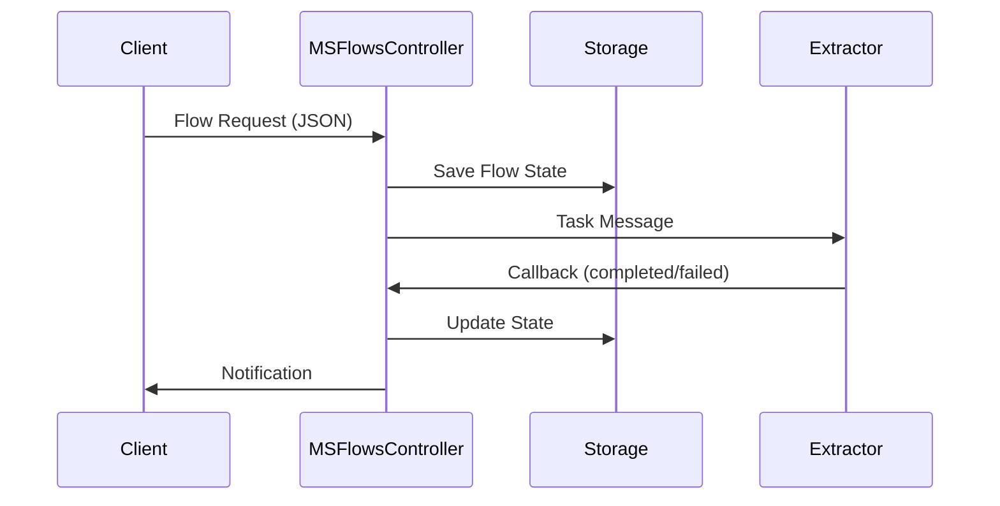
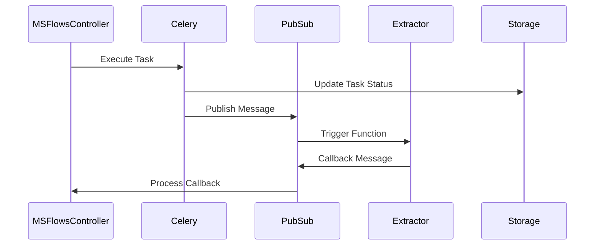

# MSFlowsController

## 📋 Descripción

**MSFlowsController** es el núcleo del sistema de orquestación de flujos de datos de Mind Hotel Insights. Es una Cloud Function que actúa como coordinador central para gestionar la ejecución de flujos de trabajo complejos, comunicándose con múltiples extractores y servicios mediante Pub/Sub.

## 🎯 Funcionalidades Principales

### 1. **Orquestación de Flujos**
- **Inicio de flujos**: Procesa solicitudes de nuevos flujos de trabajo
- **Continuación de flujos**: Gestiona la ejecución secuencial de pasos
- **Callbacks**: Procesa respuestas de Cloud Functions ejecutadas

### 2. **Gestión de Estados**
- **Seguimiento de ejecución**: Monitorea el estado de cada paso del flujo
- **Persistencia**: Almacena el estado de ejecución en Cloud Storage
- **Recuperación**: Maneja fallos y reintentos automáticos

### 3. **Comunicación Asíncrona**
- **Pub/Sub Integration**: Comunicación bidireccional con extractores
- **Topic Management**: Gestión automática de topics por tipo de extractor
- **Message Routing**: Enrutamiento inteligente de mensajes

### 4. **Notificaciones**
- **Email notifications**: Alertas de éxito, fallo y advertencias
- **Logging centralizado**: Registro detallado de todas las operaciones
- **Monitoring**: Seguimiento en tiempo real del estado de los flujos

## 🏗️ Arquitectura

```
┌─────────────────┐    ┌──────────────────┐    ┌─────────────────┐
│   Client/API    │───▶│ MSFlowsController│───▶│   Extractors    │
│                 │    │                  │    │                 │
│ - Flow Request  │    │ - Flow Start     │    │ - MSaxional     │
│ - JSON Config   │    │ - Task Execution │    │ - MSavalon      │
│                 │    │ - Callback Proc  │    │ - MSreviewpro   │
└─────────────────┘    └──────────────────┘    │ - MSsharepoint  │
                                │               │ - MSbusiness   │
                                ▼               │ - MSholded     │
                        ┌──────────────────┐    │ - MSmadisa     │
                        │   Cloud Storage  │    └─────────────────┘
                        │                  │
                        │ - Flow States    │
                        │ - Run History    │
                        │ - Configurations │
                        └──────────────────┘
```

## 🔄 Procesos de Comunicación

### 1. **Inicio de Flujo**



### 2. **Ejecución de Tareas**



## 📁 Estructura del Proyecto

```
MSFlowsController/
├── main.py                 # Punto de entrada principal
├── tasks.py               # Tareas Celery para ejecución asíncrona
├── celery_app.py          # Configuración de Celery
├── n8n_engine.py          # Motor de ejecución de flujos
├── cloudbuild.yaml        # Configuración de despliegue
├── requirements.txt       # Dependencias Python
├── core/                  # Módulos principales
│   ├── handlers/          # Manejadores de eventos
│   │   ├── flow_handlers.py
│   │   └── callback_handler.py
│   ├── notifications/     # Sistema de notificaciones
│   │   └── notification_service.py
│   └── utils/            # Utilidades
│       └── message_utils.py
├── worker/               # Lógica de negocio
│   └── flowscontroller.py
├── flows/                # Definiciones de flujos
│   └── dynamic/
├── storage/              # Repositorios de datos
│   └── repositories.py
└── tests/                # Pruebas unitarias
```

## 🚀 Configuración y Despliegue

### Variables de Entorno

```bash
# Configuración del proyecto
_M_PROJECT_ID=mind-hotel-insights-dev
_M_FUNCTION_EXECUTION_REGION=europe-southwest1
_M_ENV_ACRONYM=dev

# Buckets de almacenamiento
_M_BUCKET_DATA=ocean_data
_M_BUCKET_LASTEST_EXECUTION=lastest_incremental_data
FLOWS_BUCKET=ocean_flows_graphs
RUNS_BUCKET=ocean_flows_runs
```

### Despliegue

```bash
# Despliegue automático via Cloud Build
gcloud builds submit --config cloudbuild.yaml

# Despliegue manual
gcloud functions deploy MSFlowsController \
  --runtime=python312 \
  --gen2 \
  --region=europe-southwest1 \
  --memory=32GB \
  --cpu=8 \
  --entry-point=FlowWorker \
  --trigger-topic=ms-flows-controller \
  --timeout=540s
```

## 📨 Formatos de Mensajes

### 1. **Inicio de Flujo**

```json
{
  "flow_id": "test-flow-001",
  "account": "fergus",
  "name": "Flujo de Prueba",
  "description": "Descripción del flujo",
  "notifications": {
    "success": {
      "type": ["email"],
      "recipients": "user@example.com",
      "message": "Flujo completado exitosamente"
    },
    "fail": {
      "type": ["email"],
      "recipients": "admin@example.com",
      "message": "Flujo falló"
    }
  },
  "steps": [
    {
      "id": "step-1",
      "name": "Extracción de Datos",
      "type": "ms-extractor-avalon",
      "config": {
        "_m_account": "fergus",
        "datasets": ["RECCardex"]
      }
    }
  ]
}
```

### 2. **Callback de Extractor**

```json
{
  "flow_id": "test-flow-001",
  "account": "fergus",
  "run_id": "run-12345",
  "task_id": "step-1",
  "status": "completed",
  "step": "ms-extractor-avalon",
  "result": {
    "status": "completed",
    "message": "Extracción exitosa"
  }
}
```

## 🔧 Tipos de Extractores Soportados

| Extractor | Topic | Descripción |
|-----------|-------|-------------|
| **MSaxional** | `ms-extractor-axional` | Sistema contable Axional |
| **MSavalon** | `ms-extractor-avalon` | Sistema hotelero Avalon |
| **MSreviewpro** | `ms-extractor-reviewpro` | Plataforma de reviews |
| **MSsharepoint365** | `ms-extractor-sharepoint365` | SharePoint Online |
| **MSbusinesscentral** | `ms-extractor-businesscentral` | Microsoft Business Central |
| **MSholded** | `ms-extractor-holded` | ERP Holded |
| **MSmadisa** | `ms-extractor-madisa` | Sistema POS Madisa |

## 📊 Estados de Ejecución

### Estados de Flujo
- **`pending`**: Flujo en cola de ejecución
- **`running`**: Flujo en ejecución
- **`completed`**: Flujo completado exitosamente
- **`failed`**: Flujo falló
- **`cancelled`**: Flujo cancelado

### Estados de Tarea
- **`pending`**: Tarea pendiente de ejecución
- **`executing`**: Tarea en ejecución
- **`completed`**: Tarea completada
- **`failed`**: Tarea falló
- **`skipped`**: Tarea omitida

## 🔍 Monitoreo y Logs

### Logs Principales

```bash
# Ver logs del MSFlowsController
gcloud functions logs read MSFlowsController --region=europe-southwest1 --limit=50

# Filtrar por tipo de evento
gcloud functions logs read MSFlowsController --region=europe-southwest1 --filter="severity>=INFO"
```

### Métricas Importantes

- **Tiempo de ejecución**: Duración total del flujo
- **Tasa de éxito**: Porcentaje de flujos completados
- **Tiempo de respuesta**: Latencia de comunicación con extractores
- **Errores por tipo**: Clasificación de fallos

## 🛠️ Desarrollo y Testing

### Pruebas Locales

```python
# Ejemplo de prueba local
import json
from main import FlowWorker

# Simular evento de Pub/Sub
test_event = {
    "data": {
        "message": {
            "data": base64.b64encode(json.dumps({
                "flow_id": "test-flow",
                "account": "test",
                "steps": [...]
            }).encode()).decode()
        }
    }
}

# Ejecutar función
result = FlowWorker(test_event)
```

### Testing de Flujos

```bash
# Enviar mensaje de prueba
gcloud pubsub topics publish ms-flows-controller \
  --message='{"flow_id":"test","account":"test","steps":[]}'
```

### Validación
- **Schema Validation**: Validación de estructura de mensajes
- **Input Sanitization**: Limpieza de datos de entrada
- **Error Handling**: Manejo seguro de errores

## 📈 Escalabilidad

### Recursos
- **Memory**: 32GB (configurable)
- **CPU**: 8 cores (configurable)
- **Timeout**: 540 segundos
- **Concurrency**: Hasta 10 instancias simultáneas

### Optimizaciones
- **Celery Tasks**: Ejecución asíncrona de tareas pesadas
- **Connection Pooling**: Reutilización de conexiones
- **Caching**: Cache de configuraciones frecuentes

## 🆘 Troubleshooting

### Problemas Comunes

1. **Timeout de función**
   ```bash
   # Aumentar timeout en cloudbuild.yaml
   --timeout=900s
   ```

2. **Error de permisos**
   ```bash
   # Verificar roles IAM
   gcloud projects get-iam-policy mind-hotel-insights-dev
   ```

3. **Topic no encontrado**
   ```bash
   # Crear topic faltante
   gcloud pubsub topics create ms-extractor-[nombre]
   ```

### Logs de Debug

```bash
# Habilitar logs detallados
export LOG_LEVEL=DEBUG
gcloud functions deploy MSFlowsController --set-env-vars=LOG_LEVEL=DEBUG
```
